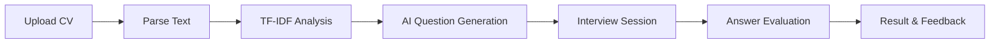

# 🎤 Interview Training System

<div align="center">


**AI-powered platform to help you ace your next job interview**

</div>

---

## 📌 Overview

Interview Training System adalah platform pelatihan wawancara berbasis AI yang membantu pengguna mempersiapkan diri untuk wawancara kerja. Pengguna dapat mengunggah CV/Resume mereka, dan sistem akan secara otomatis membuat pertanyaan wawancara yang relevan menggunakan AI.

## ✨ Features

- 🤖 **AI-Generated Questions** — Pertanyaan wawancara otomatis berdasarkan konten CV
- 📄 **CV Parser** — Upload CV dalam format PDF atau DOCX
- 🔐 **Authentication** — Sistem login/register dengan JWT
- 📊 **Session History** — Rekam dan review sesi wawancara sebelumnya
- 📈 **Result Analysis** — Evaluasi jawaban dengan feedback detail
- 🎯 **Role-based Questions** — Pertanyaan disesuaikan dengan posisi yang dilamar

## 🛠️ Tech Stack

| Layer | Technology |
|-------|-----------|
| **Backend** | FastAPI 0.115, Python 3.11+ |
| **Frontend** | React 18, Vite |
| **Database** | MongoDB (Motor async driver) |
| **Auth** | JWT (PyJWT), bcrypt |
| **ML** | scikit-learn (TF-IDF, Cosine Similarity) |
| **AI** | External LLM API integration |
| **File Parsing** | PyPDF2, python-docx |

## 📁 Project Structure

```
interview-training-system/
├── backend/
│   ├── server.py          # FastAPI main application
│   ├── requirements.txt   # Python dependencies
│   └── .env.example       # Environment variables template
├── frontend/
│   ├── src/
│   │   ├── pages/
│   │   │   ├── LandingPages.jsx    # Landing page
│   │   │   ├── AuthPages.jsx       # Login & Register
│   │   │   ├── Dashboard.jsx       # Main dashboard
│   │   │   ├── InterviewSession.jsx # Interview session
│   │   │   └── ResultPages.jsx     # Results & analysis
│   │   ├── components/    # Reusable UI components
│   │   ├── lib/           # Utility functions
│   │   ├── app.jsx        # Root component
│   │   └── main.jsx       # Entry point
│   ├── public/
│   └── package.json
└── .gitignore
```

## 🚀 Quick Start

### Prerequisites
- Python 3.11+
- Node.js 18+
- MongoDB Atlas account (or local MongoDB)

### Backend Setup

```bash
# Clone repo
git clone https://github.com/alkayyiss-ds/interview-training-system.git
cd interview-training-system/backend

# Create virtual environment
python -m venv venv
source venv/bin/activate  # Windows: venv\Scripts\activate

# Install dependencies
pip install -r requirements.txt

# Setup environment variables
cp .env.example .env
# Edit .env dengan credentials kamu

# Run server
uvicorn server:app --reload --port 8000
```

### Frontend Setup

```bash
cd frontend

# Install dependencies
npm install

# Run development server
npm start
```

### Environment Variables

```env
MONGO_URL=mongodb+srv://<user>:<password>@cluster.mongodb.net/
DB_NAME=interview_db
JWT_SECRET=your-super-secret-jwt-key
AI_API_KEY=your-ai-api-key
```

## 🔌 API Endpoints

| Method | Endpoint | Description |
|--------|----------|-------------|
| `POST` | `/api/auth/register` | Register user baru |
| `POST` | `/api/auth/login` | Login & dapatkan JWT token |
| `POST` | `/api/upload/cv` | Upload CV (PDF/DOCX) |
| `POST` | `/api/interview/start` | Mulai sesi interview |
| `POST` | `/api/interview/answer` | Submit jawaban |
| `GET` | `/api/interview/result/{id}` | Lihat hasil interview |
| `GET` | `/api/history` | Riwayat sesi interview |

## 📊 How It Works



## 📝 License

MIT License — feel free to use and modify!

---

<div align="center">
Made with ❤️ by <a href="https://github.com/alkayyiss-ds">alkayyiss-ds</a>
</div>
